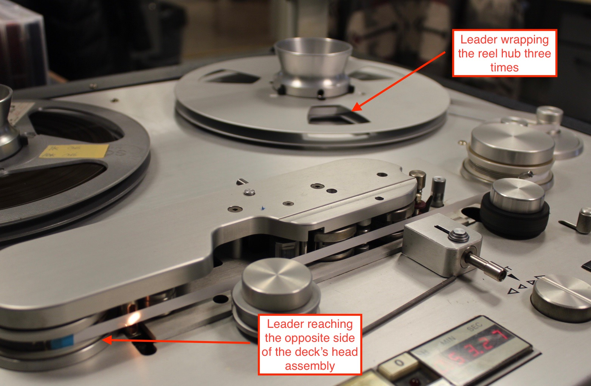

# Adding/Replacing Leader Tape Workflow. 

## Overview 

The following workflow is for adding or replacing leader tape on open-reel tape.

## Supplies 

Leader tape
Splicing tape
Splicing block
Straight-edge razor

## Workflow

1) Remove and old splicing tape, adhesive and damaged leader tape from the audio tape (SEE OTHER WORKFLOW)

2) Place the cleaned audio tape in a splicing block.  Select the cutting guide on the block which will make the least destructive cut to the tape; place the audio tape over cutting guide, extending only enough to allow for a clean, even cut with minimal loss to the audio tape. Do not cut the tape yet.

3) Cut a piece of leader tape.  

* For leadering a tape's head or tail, the length the new leader tape should be enough to wrap around the reel hub three times and extend to the opposite side of the deck's head assembly; this length is often approximatly eight feet.
 
* For leadering internal edits, the length of the new leader tape should be equal to the leader tape being replaced.  

4) Place the new leader tape into the splicing block *on top* of the audio tape (see step 1).  The new leader tape should extend approximatly one inch over the cutting guide and secure the audio tape into place.

5) Cut the leader and the audio tape, simultaniously, with a straight-edge razor.

6) Butt the newly cut leader tape and audio tape to form a tight joint.

7) Cut a small piece of splicing tape (less than one-half inch is usualy sufficient) and afix it to the splice joint.

